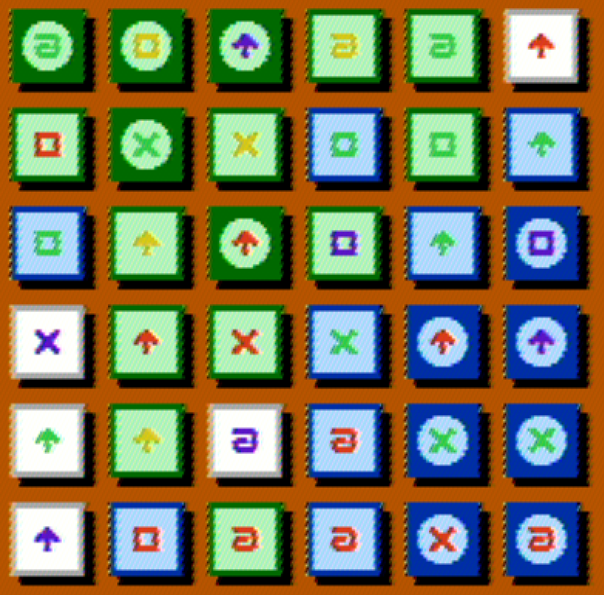

# Blockade

A 2 player strategy board game... for the NES. Made during the [2021 Global Game Jam](https://globalgamejam.org/2021/games/blockade-3).

# Rules

Players take turns matching sets to capture tiles. Each tile has 4 possible symbols and 4 possible colors. A matching set consists of 4 matching symbols with 4 different colors, or 4 matching colors and 4 different symbols.

Capture tiles that are surrounded on all 4 sides become part of the blockade and are drawn darker. Blockade tiles can be used by your opponent to make a match, but they cannot be captured from you.

The game ends when the all tiles have been captured, and the player with the most captured tiles wins.
